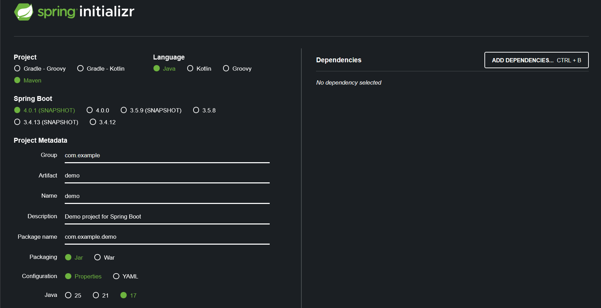

# **Generate Spring Boot Initial Project** 

ตามภาพที่คุณส่งมา โดยจะอธิบายความหมายของแต่ละช่องและเหตุผลในการเลือกค่าเหล่านั้น

---

# 🟢 ภาพรวมของ Spring Initializr

Spring Initializr คือเครื่องมือช่วยสร้างโปรเจกต์เริ่มต้น (template project) ของ Spring Boot โดยอัตโนมัติ ทำให้เราสามารถเริ่มพัฒนาได้เร็วขึ้น โดยไม่ต้องตั้งค่าโครงสร้างโปรเจกต์เอง

---

# ✨ คำอธิบายค่าต่าง ๆ ตามภาพ

## 🔹 **Project (ชนิดการ build project)**

เลือก: **Maven**

* Maven เป็น build tool ยอดนิยม ใช้จัดการ dependency, build, test
* เป็นตัวเลือกมาตรฐานสำหรับโปรเจกต์ Java/Spring

---

## 🔹 **Language (ภาษาที่ใช้เขียน)**

เลือก: **Java**

* Spring Boot รองรับหลายภาษา แต่ Java เป็นตัวใช้มากที่สุด

---

## 🔹 **Spring Boot Version**

เลือก: **4.0.1 (SNAPSHOT)**

* SNAPSHOT คือเวอร์ชันพัฒนา (ยังไม่ stable)
* เหมาะกับการทดลองฟีเจอร์ใหม่
* หากต้องการความเสถียรควรเลือกเวอร์ชัน **Release**

---

# 🏷️ Project Metadata (ข้อมูลเกี่ยวกับโปรเจกต์)

## 1️⃣ **Group**

ค่าที่กรอก: `com.example`

* ใช้เป็นชื่อโดเมนกลับหลัง ให้เป็น unique namespace ของโปรเจกต์
* ตัวอย่างในองค์กรจริงอาจเป็น เช่น `com.fnsyrus`, `com.finansia.devops`

---

## 2️⃣ **Artifact**

ค่าที่กรอก: `demo`

* คือชื่อไฟล์โปรเจกต์ (เช่น demo.jar)
* เป็นชื่อ root ของ application

---

## 3️⃣ **Name**

ค่าที่กรอก: `demo`

* ชื่อโปรเจกต์ที่ใช้แสดงผลมนุษย์อ่าน
* Spring Boot จะใช้เป็นค่า `spring.application.name=demo` ในบางกรณี

---

## 4️⃣ **Description**

ค่าที่กรอก: `Demo project for Spring Boot`

* ใส่คำอธิบายโปรเจกต์

---

## 5️⃣ **Package Name**

ค่าที่ระบบสร้างให้: `com.example.demo`

* เป็น package หลักของ source code
* Spring Boot จะ scan component ต่าง ๆ จาก package นี้

---

## 6️⃣ **Packaging**

เลือก: **Jar**

* Jar = แอปทั่วไปรันด้วย `java -jar`
* War = ใช้ deploy ใน servlet container (เช่น Tomcat แบบ external)

ปัจจุบัน 99% ของ Spring Boot ใช้ Jar

---

## 7️⃣ **Configuration Format**

เลือก: **Properties**

* Spring Boot รองรับ `application.properties` หรือ `application.yaml`
* Properties เหมาะกับมือใหม่และโครงการทั่วไป

---

## 8️⃣ **Java Version**

เลือก: **17**

* เป็น LTS (Long-term support)
* Spring Boot 3+ รองรับ Java 17 ขึ้นไป
* เหมาะสมสำหรับโปรเจกต์ใหม่ที่สุด

---

# 🔧 Dependencies (ยังไม่เลือก)

ส่วนนี้ยังไม่ถูกเพิ่ม dependency คุณสามารถกดปุ่ม **Add Dependencies…** เพื่อเลือกสิ่งที่โปรเจกต์ต้องใช้ เช่น

* Spring Web → สำหรับทำ REST API
* Spring Data JPA → สำหรับเชื่อม DB
* Lombok → ลด boilerplate code
* Spring Security → ระบบ auth
* H2 / MySQL Driver → เชื่อมฐานข้อมูล

---

# 🎯 สรุปสั้น ๆ

ค่าต่าง ๆ ที่คุณกรอกในภาพเป็นการสร้างโปรเจกต์ Spring Boot พื้นฐาน ประกอบด้วย:

| ส่วน        | ค่า            | ความหมาย                         |
| ----------- | -------------- | -------------------------------- |
| Project     | Maven          | ใช้ build และจัดการ dependencies |
| Language    | Java           | ภาษา Java                        |
| Spring Boot | 4.0.1-SNAPSHOT | เวอร์ชันทดลอง                    |
| Group       | com.example    | namespace                        |
| Artifact    | demo           | ชื่อโปรเจกต์                     |
| Packaging   | Jar            | build เป็นไฟล์ .jar              |
| Config      | Properties     | ใช้ application.properties       |
| Java        | 17             | เวอร์ชันที่รองรับ Spring Boot    |

---

ถ้าต้องการให้ผมแนะนำ dependencies สำหรับทำ
✔ REST API
✔ Microservice
✔ Kafka
✔ Spring Security
✔ JPA + Database

บอกประเภทโปรเจกต์ที่คุณต้องการได้เลยครับ!
